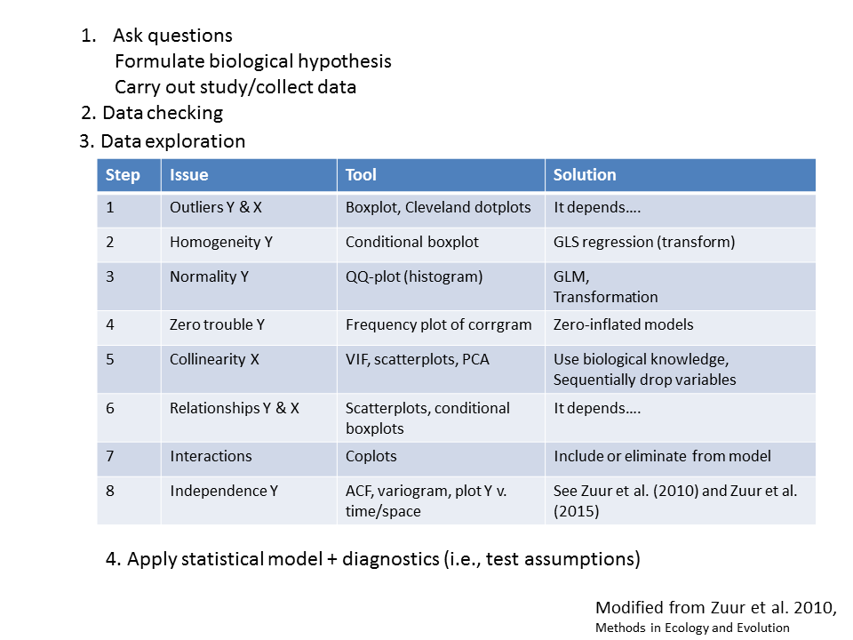

```{r setup, echo=FALSE, results="hide", message=FALSE, warning=FALSE}
#knitr::opts_knit$set(root.dir = '..')
knitr::opts_chunk$set(cache = TRUE, 
                      fig.align = "center", 
                      fig.height = 4.5, 
                      fig.width = 7.5,
                      dev = "svg")

library(readr)
library(tidyr)
library(dplyr)
library(ggplot2)
library(magrittr)
library(car)
library(psych)

df <- read_csv("data/capelin_condition_maturation_v1.csv")

df <- df[c(1:5, 7:15)]
glimpse(df)
head(df)
df$weight

df3 <- df %>%
     filter(year > 1992 &  age == 1 & maturity != 6 & project != 10 & as.factor(month) %in% c("10", "11", "12") & as.factor(nafo_div) %in% c(23, 31, 32)) %>% #one-year males after 1992, just project 23 sex == 1 &
     filter(!is.na(weight)) %>%
     filter(!is.na(length)) 

#make these variables factors
cols <- c("project", "nafo_div", "sex", "maturity")
df3 %<>%
     mutate_each_(funs(factor(.)),cols)
glimpse(df3)

#change values to something interpretable
df3$nafo_div <- as.factor(df3$nafo_div)
levels(df3$nafo_div)[levels(df3$nafo_div) == "23"] <- "2J"
levels(df3$nafo_div)[levels(df3$nafo_div) == "31"] <- "3K"
levels(df3$nafo_div)[levels(df3$nafo_div) == "32"] <- "3L"
levels(df3$sex)[levels(df3$sex) == "1"] <- "Male"
levels(df3$sex)[levels(df3$sex) == "2"] <- "Female"

# check levels of data to ensure that subset worked
levels(df3$project)
levels(as.factor(df3$sample_number))
levels(as.factor(df3$year))
levels(as.factor(df3$month))
levels(df3$nafo_div)
levels(df3$maturity)
range(df3$weight)
range(df3$length)
levels(as.factor(df3$age))

# abiotic data
abiotic <- read_csv("data/trawl_abiotic.csv", guess_max = 5000)
cape <- read_csv("data/all_data_a1.csv", guess_max = 5000)

# Neries data
source("D://Keith//R/zuur_rcode//TESA-Zuur//course material//HighstatLibV6.R")
Nereis <- read_tsv("data/Nereis.txt")
sp <- read_tsv("data/SparrowsElphick.txt")
```

## An R/RStudio safety moment
- Git in Rstudio
- R and reproducible research
- The outline tool 

## Goals
- Reinforce "intro to R"
- Prepare for Zuur course
- Learn systematic steps for Exploratory Data Analysis (EDA)
    - Introduction to the tidyverse
    - Use ggplot2 for EDA

- Were you able to ...
    - install packages (readr, tidyr, dplyr, ggplot2, magrittr, car, psych)
    - source 
        - HighstatLibV6.R
    - data sets
        - capelin_condition_maturation_v1.csv, trawl_abiotic.csv, all_data_a1.csv, trawl_biotic.csv

## Outline
- a brief history of EDA
- Zuur's protocols
- a **brief** tidyverse introduction
- Zuur's EDA Steps
- thoughts/conclusions
- exercises

## EDA: a brief history (John Tukey)
- literally, wrote the book "Exploratory Data Analysis" (1977)
- created many of the commonly used graphs (box plots & stem-and-leaf diagrams)
- *"The greatest value of a picture is when it forces us to notice what we never expected to see."* — John Tukey
- *"The combination of some data and an aching desire for an answer does not ensure that a reasonable answer can be extracted from a given body of data."* - John Tukey
- sadly, EDA is neglected in most stats courses
  
## EDA: a brief history (Alain Zuur et al.) 
- Alain Zuur - the ecologist's statistician
- *"for a given analysis, spend 50% of your time on EDA"* - Zuur et al.(2010)
    - MEE 2010: 3-14
    - Book: Ieno and Zuur (2015):
```{r, echo = F, out.width='25%', fig.align='right', fig.cap='...'}

```    

## Zuur's protocol for data exploration
```{r, echo = F, out.width='80%', fig.align='center', fig.cap='...'}

```    

## Tangent alert: What is the Tidyverse?
```{r, echo = F, out.width='50%', fig.align='center', fig.cap='...'}
knitr::include_graphics('../figures/hadley.jpg')
```    

(although Hadley $\ne$ tidyverse)

## Tangent alert: What is the Tidyverse?
- R packages for working with "tidy"" data
- Workflow based on functions that:
    - Are all simple verbs that do one thing (arrange, mutate, summarize, etc.)
    - **Play well with each other**

## A tidyverse intro: readr {.build}
- Package for reading flat files into R

```
cape <- read_csv("data/capelin_condition_maturation_v1.csv") # for csv

```
## A tidyverse intro: dplyr
- one stop shop for data manipulation
- **many** useful functions, e.g.,:
- "filter" is like "subset"
    - filter(df, factor == "level") e.g., nafo_div == "3L"
    - filter(df, numeric > X) e.g., year > 2002
- "joins" = database functions: bring data sets together
    - join(df1, df2, by = "a factor or unique ID")
- "gather" turns wide (tabular) data into long (model based) data
- pipes "%>%" make code easier to read (left to right)

## A tidyverse intro: ggplot2
- The grammar of graphics
- layer
<div class = "red2">
    - data
    - mappings (aesthetics)
    - geometry (points, lines, polygons)
    </div>
    - statistics (binning)
    - position
- scales (colour, size, shape, axes)
- coordinates (e.g. Cartesian)
- faceting (multiple subsets; lattice)

## A tidyverse intro: ggplot2 - scatterplot  {.build}

```{r, warning=FALSE}
ggplot(data = abiotic, aes(x = temp_bottom, y = depth)) + geom_point()
```

## A tidyverse intro: ggplot2 - geoms
- geom_point()
- geom_histogram()
- geom_boxplot()
- dot_plot()
- and many, many others

## The data situation
- capelin
- lengths and weights
- used to calculate a condition index
- Are there any problems with these data

## Step 1 Are there outliers in X and Y? {.smaller}
```{r, warning=F, message=F}
filter(df3, year > 2012) %>% 
  ggplot(aes(x = as.numeric(length))) + geom_dotplot() + facet_wrap(~year)
```

## Step 1 Are there outliers in X and Y?{.smaller}
The Cleveland dotplot 
```{r, fig.width=7, fig.height=4}
df3$id <- row.names(df3)
filter(df3, year > 2012) %>% 
ggplot(aes(y = id, x = length)) + geom_point() + facet_wrap(~year)
```

## Step 2: Do we have homogeneity of variance?
```{r}
filter(df3, sex != 3) %>% 
  ggplot(aes(x = as.factor(year), y = length)) + geom_boxplot() + facet_grid(rows = vars(sex))
```

## Step 3: Are the data normally distributed?
- What does Zuur mean by this?
- Normality of the data *at each covariate value*
- Does this conflict with Schenider and most statistical authorities? No.

## Step 3: Are the data normally distributed?
```{r, warning=F, message=F, fig.width=7, fig.height=4}
  ggplot(data = df3, aes(x = length)) + geom_histogram() + facet_wrap(~sex)
```

## Step 3: Are the data normally distributed?
- use QQ plots (especially on the resids!!!!)
```{r, warning=F, message=F, fig.width=6, fig.height=3.4}
p <-  ggplot(data = df3, aes(sample = length)) 
p <- p + stat_qq() + stat_qq_line()
p
```

## Step 4: Are there lots of zeros in the data?
```{r, message = F}
p <- ggplot(df3, aes(x=weight))
p + geom_histogram() 

```

## Step 4: Are there lots of zeros in the data?
Or, you can just filter the data set...
```{r}
filter(df3, weight == 0)

```

## Change the data sets
- capelin data set
  - RV: ln(capelin biomass)
  - EV: t*ice*, condition, larval abundance, zooplankton 
  - SV: year

## Step 5: Is there collinearity among the covariates (pairs plots)?
- Collinearity is the existence of correlation between covariates (Zuur et al. 2010)
- Confuses statistical analysis

## Step 5: Is there collinearity among the covariates (pairs plots)? {.smaller}
```{r, warning=F,fig.width=7, fig.height=4}
scatterplotMatrix(~ ln_biomass_med	+ tice + 	meanCond_lag	+ surface_tows_lag2 +	ps_sdTot_lag2
, reg.line=lm, smooth=TRUE, spread=FALSE, span=0.5, diagonal = 'density', data=cape)
```

## Step 5: Is there collinearity among the covariates? {.smaller}
```{r, warning=F,fig.width=7, fig.height=4}
pairs.panels(cape[c("ln_biomass_med", "tice", "meanCond_lag", "surface_tows_lag2", "ps_sdTot_lag2")], 
             method = "pearson", # correlation method
             hist.col = "#00AFBB", density = F,  # show density plots
             ellipses = F, # show correlation ellipses,
             cex.labels = 1, cex.cor = 1)
```

## Step 5: Is the collinearity among the covariates?
- Not EDA but after running the model, calculate the Variance Inflation Factor (VIF)
1/(1-R^2^~j~) - see Zuur et al. (2010) for more details

## Step 6: What are the relationships betwen Y and X variables? 
```{r, message = F, warning = F,fig.width=7, fig.height=4}
ggplot(data=cape) + geom_point(aes(x=tice, y = ln_biomass_med))
```


## Step 6: What are the relationships betwen Y and X variables? {.smaller}
```{r, fig.width=7, fig.height=4, tidy.opts=list(width.cutoff=20)}
p <- ggplot(data=df3) + geom_point(aes(x=log10(length), y = log10(weight), colour=nafo_div)) 
p <- p +  facet_wrap(~nafo_div)
p
```

## Step 7: Should we consider interactions?{.smaller}
Think hard about this - they can seriously complicate the analysis!!!!!
```{r, message = F, warning = F, fig.width=7, fig.height=4}
p <- ggplot(data=cape, aes(x = tice, y = ln_biomass_med)) + geom_point() 
p <- p + geom_smooth(method = lm, se = F) + facet_wrap(~ cut_number(meanCond_lag, 3))
p
```

## Step 8: Are observations of the response variable independent?
*"Testing for independece is not always easy"* - Zuur et al. 2010

- order of observations is not enough
- beyond scope of seminar but:
    - temporal independence -> ACF
    - spatial independence -> Resids v space
- see Zuur et al. (2010) or (2017)

## Thoughts and conclusions
- This is NOT an exact science; be flexible
- Important part of the analysis (50% of time)
- EDA need not be publication quality (get it done)
- Make it reproducible (i.e., make a *.Rmd file)

- Your turn: do this with the trawl_abiotic and trawl_biotic data

## To get started 
- read in trawl_abiotic and trawl_biotic with read_csv
- "gather" the trawl_biotic data
- "join" the datasets
- biomass <- read_csv("data/trawl_biomass.csv") %>%
  gather(key = species, value = biomass, shrimp:redfish)
- trawl <- biomass %>% 
  left_join(abiotic, by = c("year", "trawl_id"))
- Work with a subset of trawl (say "shrimp" & > 2008)
- Take code from the presentation and modify for trawl

## References

- Cleveland. 1994. The Elements of Graphing Data. Summing (NJ): Hobart Press
- Ieno and Zuur. 2015. A Beginner's Guide to Data Exploration and Visualization with R. Highland Statistics Ltd. 
http://highstat.com/index.php/beginner-s-guide-to-data-exploration-and-visualisation

- Tukey. 1977. Exploratory Data Analysis. Reading (MA): Addison-Wesley
- Yeager et al. 2007. Graphical methods for exploratory analysis of complex data sets. BioScience 57: 673-679.
- Zuur et la. 2010. A protocol for data exploration to avoid common statistical problems. MEE 2010: 3-14 

