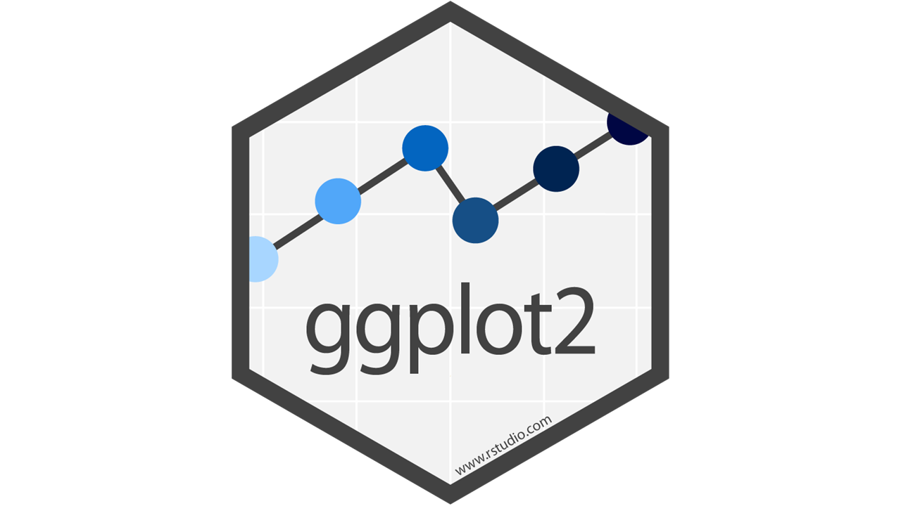

Plotting in the tidyverse: ggplot2
========================================================
author: Paul Regular and Keith Lewis  
date: 2017-10-01
width: 1540
height: 900
autosize: true
<div align="center">

</div>


Rstudio tips
========================================================
incremental: true
- Arguements
  - gather(data = dune_sp, key=species, value = "cover_class", Achimill:Callcusp) or
  - gather(dune_sp, species, "cover_class", Achimill:Callcusp) 
- Use the editor and pass to consol with Ctrl-enter
- The cheatsheets

Outline
========================================================
incremental: true
- Plotting options
- Grammar of graphics
- ggplot2: the basics
- ggplot2: intermediate
- ggplot2: advanced stuff

- Cookbook for R

Plotting options
========================================================
incremental: true
- spreadsheets, e.g., Excel (hint: it sucks!)
- stand alone packages, e.g., Sigma Plot
- other stats packages, e.g., SAS
- R
  - base
  - various functions
  - ggplot2 (part of the tidyverse)
    - qplot

the grammar of graphics
========================================================
incremental: true
- layer
  - data
  - mappings (aesthetics)
  - geometry (points, lines, polygons)
  - statistics (binning)
  - position
- scales (colour, size, shape, axes)
- coordinates (e.g. Cartesian)
- faceting (multiple subsets; lattice)

ggplot2: the basics
========================================================
incremental: true
- scatterplot
- boxplot
- stacked bar
- saving the output

ggplot2: the basics - mtcars
========================================================

```r
str(mtcars)
```

```
'data.frame':	32 obs. of  11 variables:
 $ mpg : num  21 21 22.8 21.4 18.7 18.1 14.3 24.4 22.8 19.2 ...
 $ cyl : num  6 6 4 6 8 6 8 4 4 6 ...
 $ disp: num  160 160 108 258 360 ...
 $ hp  : num  110 110 93 110 175 105 245 62 95 123 ...
 $ drat: num  3.9 3.9 3.85 3.08 3.15 2.76 3.21 3.69 3.92 3.92 ...
 $ wt  : num  2.62 2.88 2.32 3.21 3.44 ...
 $ qsec: num  16.5 17 18.6 19.4 17 ...
 $ vs  : num  0 0 1 1 0 1 0 1 1 1 ...
 $ am  : num  1 1 1 0 0 0 0 0 0 0 ...
 $ gear: num  4 4 4 3 3 3 3 4 4 4 ...
 $ carb: num  4 4 1 1 2 1 4 2 2 4 ...
```

```r
mtcars$am <- as.factor(mtcars$am)
mtcars$cyl <- as.factor(mtcars$cyl)
```

ggplot2: the basics - scatterplot
========================================================

```r
ggplot(data=mtcars, aes(x = mpg, y = disp)) + geom_point()
```


ggplot2: the basics - box-whisker plot
========================================================

```r
ggplot(data=mtcars, aes(x = cyl, y = mpg)) + geom_boxplot()
```


ggplot2: the basics - stacked bargraph
========================================================

```r
ggplot(data=mtcars, aes(x= cyl, y=mpg, fill=am)) + 
  geom_bar(stat="identity") # statistics modifies geom
```


ggplot2: the basics - saving the figure
========================================================

```r
pdf("plots.pdf")            # saves to working directory
ggplot(data=mtcars, aes(x= cyl, y=mpg, fill=am)) + 
  geom_bar(stat="identity") 
dev.off()                   # turns graphing device off
```

Basic exercises
========================================================
- Load the trawl biomass data using readr.
- Remove three of the species
- Make a boxplot of biomass by year
- save the file as a pdf


ggplot2: intermediate - move away from defaults to publication quality
========================================================
incremental: true
- change size, colour, and shape
- axes
- legends

ggplot2: intermediate - make an object
========================================================

```r
p <- ggplot(data=mtcars, aes(x = mpg, y = disp)) 
p + geom_point()
```


ggplot2: intermediate - make an object....then add more grammar
========================================================

```r
p <- ggplot(data=mtcars, aes(x = mpg, y = disp)) 
p + geom_point(shape=20, size=2.5, colour = "red")  # change the scales
```


ggplot2: intermediate - then add more grammar
========================================================

```r
p <- ggplot(data=mtcars, aes(x = mpg, y = disp, colour = cyl)) 
p + geom_point(shape=20, size=2.5) +  # change the object
  ylab("Displacement (cu. in)") +     # change label of y-axis
  xlab("Miles per gallon") +          # change label of x-axis
  labs(fill = "Number of cylinders")  # change label of legend
```


ggplot2: intermediate - and still more grammar
========================================================

```r
ggplot(data=mtcars, aes(x= cyl, y=mpg, fill=am)) + 
  geom_bar(stat="identity") + 
  ylab("Number of cylinders") +     
  xlab("Miles per gallon") +          
  labs(fill = "Automatic/\nManual") +     # \n ~ "return"
  scale_fill_brewer(palette= "Pastel1") + # change bar colours
  theme_bw()                              # change background
```


Intermediate exercises
========================================================
- Use either the trawl abiotic or biomass data and create a chart
- Then, make it publication quality 
  - change the axis label
  - change the background
- save it as a pdf or other file type

ggplot2: advanced stuff
========================================================
incremental: true
 - tidyverse
 - facets
 - maps
 - working with layers
 - multiple plots

ggplot2 and the tidyverse
========================================================


```r
diamonds %>%                  # Start with the 'diamonds' dataset
  filter(cut == "Ideal") %>%  # Then, filter down to rows where cut == Ideal
  ggplot(aes(price)) +        # Then, determine aes
    geom_histogram()          # plot histograms
```


ggplot2 and the tidyverse and facets
========================================================

```r
diamonds %>%                   # Start with the 'diamonds' dataset
  filter(cut == "Ideal") %>%   # Then, filter down to rows where cut == Ideal
  ggplot(aes(price)) +         # Then, determine aes
    geom_histogram() +         # plot histograms
    facet_wrap(~ color)        # in plots by 'color' 
```


ggplot2 and layers
========================================================

```r
# no layers
ggplot(data = diamonds, aes(x = carat, y = price, colour = cut)) # run this line - what happens?
```


ggplot2 and layers
========================================================

```r
# one layer
ggplot(data = diamonds,               # the data and mapping/aesthetics
       aes(x = carat, y = price, colour = cut)) + 
        geom_point()                  # the point layer
```


ggplot2 and layers
========================================================

```r
# one layer but with data specific to layer
ggplot() +                              # the data and mapping/aesthetics
  geom_point(data = diamonds,           # the point layer
             aes(x = carat, y = price, colour = cut))                                                   # 
```


ggplot2 and layers
========================================================

```r
# two layers
ggplot(data = diamonds, aes(x = carat, y = price, colour = cut)) + # the data and mapping/aesthetics
  geom_point() +                                                    # the point layer
  geom_smooth()                                                    # the line layer
```


ggplot2 and layers
========================================================
this is not the right code
p <- ggplot (dfs.sa2, aes(x=Year, y=s, group=StudyArea, fill=StudyArea)) #data and aes

p +  geom_errorbar(position = pd, width=0.1, colour="black", aes(ymin=sLL, ymax=sUL)) + 	#plot bars
geom_point (aes(fill=StudyArea), position = pd, shape=22, size=4) + #plot points
scale_fill_manual (name = "Study Area", values=cols, breaks = c("Middle Ridge 	North", "Middle Ridge South", "La Poile", "Northern Peninsula"), 	labels=studyarea, limits=c("Middle Ridge North", "Middle Ridge South", "La 	Poile", "Northern Peninsula")) + #specify colours
ylab("Survival rate") + #label y-axis
scale_y_continuous(limits=c(0,1)) + # set limits to y-axis
theme_bw() + #change background to white
opts(legend.justification=c(1,0), legend.position=c(.25,.75)) + #position legend
ylim(0,1)  + # set limits to y-axis
opts(axis.title.x = theme_text(size=16)) + #adjust the axis title
opts(axis.title.y = theme_text(angle = 90, size=16)) + #adjust the axis title
geom_text(aes(x=Year, y=sUL+0.05, label=n.animals), size=4, position = pd) 
# numbers over bars

caribou graph
========================================================
#type: section
#<div align="center">
#
#</div>


ggplot2 and multiple plots
========================================================


Advanced exercises
========================================================
 - Using one of the trawl data sets, use pipes to modify the data and make a figure with at least two layers
 - Trying adding layers in two different ways

Help
========================================================
Books on ggplot:
- Chang, W. 2013. R Graphics Cookbook. O'Reilly
- Wickham, H. 2009. ggplot2: elegant graphics for data analysis. Springer.

Theoretical foundation:
- Tufte, E.R. The visual display of quantitative information.  
- Wilkinson, L. 2005. The grammar of graphics. Springer.

Websites:
http://www.cookbook-r.com/   [THIS IS GOLD!!!!!!!!]
http://ggplot.yhathq.com/
https://rpubs.com/hadley/ggplot2-layers [for understanding layers]

Papers:
Su, Y-S. 2008. It's easy to produce chartjunk using MS Excel 2007 but hard to make good graphs.  Computational Statistis and Data Anlaysis. 52: 4594-4601.
https://rpubs.com/hadley/ggplot2-layers

