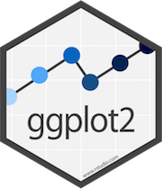

Plotting in the tidyverse: ggplot2
========================================================
author: Paul Regular and Keith Lewis  
date: 2017-10-01
width: 1540
height: 900
<div align="center">

</div>


Rstudio tips
========================================================
- Arguements - label
- Use the editor and pass to consol with Ctrl-enter

Outline
========================================================
- Plotting options
- Grammar of graphics
- ggplot2: the basics
- ggplot2: intermediate
- ggplot2: advanced stuff

Plotting options
========================================================
- Excel (hint: it sucks!)
- Sigma plot
- R
  - base
  - various functions
  - ggplot2
  - qplot

the grammar of graphics
========================================================
- data
- mappings (aesthetics)
- geometry (points, lines, polygons)
- statistics (binning)
- scales (colour, size, shape, axes)
- coordinates (e.g. Cartesian)
- faceting (multiple subsets; lattice)
- layers ()

ggplot2: the basics
========================================================
Some sort of introduction??
ggplot v qplot?

ggplot2: the basics - scatterplot
========================================================

```r
library(tidyr)
library(ggplot2)
ggplot(data=mtcars, aes(x = mpg, y = disp)) + geom_point()
```


ggplot2: the basics - box-whisker plot
========================================================

```r
str(mtcars)
```

```
'data.frame':	32 obs. of  11 variables:
 $ mpg : num  21 21 22.8 21.4 18.7 18.1 14.3 24.4 22.8 19.2 ...
 $ cyl : num  6 6 4 6 8 6 8 4 4 6 ...
 $ disp: num  160 160 108 258 360 ...
 $ hp  : num  110 110 93 110 175 105 245 62 95 123 ...
 $ drat: num  3.9 3.9 3.85 3.08 3.15 2.76 3.21 3.69 3.92 3.92 ...
 $ wt  : num  2.62 2.88 2.32 3.21 3.44 ...
 $ qsec: num  16.5 17 18.6 19.4 17 ...
 $ vs  : num  0 0 1 1 0 1 0 1 1 1 ...
 $ am  : num  1 1 1 0 0 0 0 0 0 0 ...
 $ gear: num  4 4 4 3 3 3 3 4 4 4 ...
 $ carb: num  4 4 1 1 2 1 4 2 2 4 ...
```

ggplot2: the basics - box-whisker plot
========================================================

```r
mtcars$cyl <- as.factor(mtcars$cyl)
ggplot(data=mtcars, aes(x = cyl, y = mpg)) + geom_boxplot()
```


ggplot2: the basics - stacked bargraph
========================================================

```r
mtcars$am <- as.factor(mtcars$am)
ggplot(data=mtcars, aes(x= cyl, y=mpg, fill=am)) + 
  geom_bar(stat="identity") # statistics modifies geom
```


Basic exercises
========================================================
With the trawl data, make the following (note, you may need to use data manipulation concepts from last week):


ggplot2: intermediate
========================================================
- change size, colour, and shape
- axes
- legends

ggplot2: intermediate - make an object
========================================================

```r
p <- ggplot(data=mtcars, aes(x = mpg, y = disp)) 
p + geom_point()
```


ggplot2: intermediate - make an object....then add more grammar
========================================================

```r
p <- ggplot(data=mtcars, aes(x = mpg, y = disp)) 
p + geom_point(shape=21, size=1.5, colour = "red")  # change the scales
```


ggplot2: intermediate - make an object....then add more grammar
========================================================

```r
p <- ggplot(data=mtcars, aes(x = mpg, y = disp, colour = cyl)) 
p + geom_point(shape=21, size=1.5) +  # change the object
  ylab("Displacement (cu. in)") +     # change label of y-axis
  xlab("Miles per gallon") +          # change label of x-axis
  labs(fill = "Number of cylinders")  # change label of legend
```


ggplot2: intermediate - stacked bargraph
========================================================

```r
ggplot(data=mtcars, aes(x= cyl, y=mpg, fill=am)) + 
  geom_bar(stat="identity") + 
  ylab("Number of cylinders") +     
  xlab("Miles per gallon") +          
  labs(fill = "Automatic/\nManual") +     # note that \n moves everything after to next line
  scale_fill_brewer(palette= "Pastel1") + # change colour of bars
  theme_bw()                              # change background
```


Intermediate exercises
========================================================

ggplot2: advanced stuff
========================================================
 - tidyverse
 - facets
 - maps
 - working with layers
 - multiple plots
Advanced exercises
========================================================

Help
========================================================
Books
- R Graphics Cookbook
- ggplot2: elegant graphics for data analysis
- Tufte, E.R. The visual display of quantitative information (theoretical foundation)

Websites:
http://www.cookbook-r.com/   [THIS IS GOLD!!!!!!!!]

