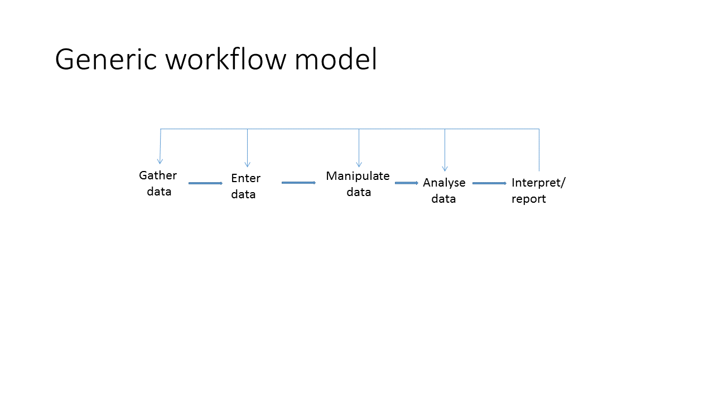
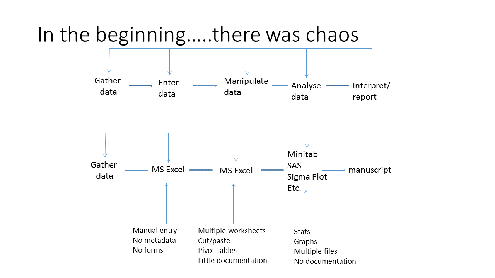
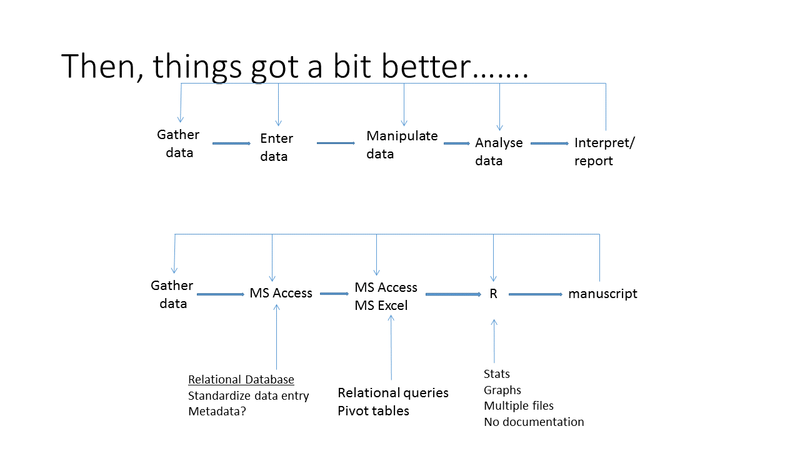
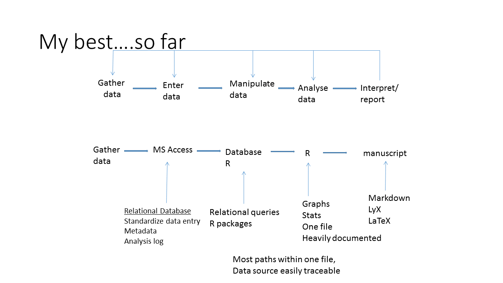

```{r setup, echo=FALSE, results="hide", message=FALSE, warning=FALSE}
knitr::opts_knit$set(root.dir = '../')
knitr::opts_chunk$set(cache = TRUE, 
                      fig.align = "center", 
                      fig.height = 4.5, 
                      fig.width = 7.5,
                      dev = "svg")
```

## Overview
- What i've learned....so far
- Reproducible Research (RR)
  - Reasons for RR
  - Workflow Evolution
  - The Tools
- RMarkdown
    - basics
    - intermediate
    - advanced

## What i've learned....so far!
Clean up the figures - add version control!!!

## Workflow evolution 1


## Workflow evolution 2


## Workflow evolution 3


## Workflow evolution 4


## A graphical model for RR and open science


## Reproducible Research (RR)
- Reproducibility is a corner stone of science
- Reproducibility is increasingly difficult
    - complex statistics
    - increased collaboration
    - Big data
    - computer scripts are increasingly central
- Traditional final product = paper
- RR final product = paper + code  + data

## Benefits of RR
- Idealistic
    - Better science
        - prevention ~ education
        - medication (traditional) ~  peer-review + editor
        - medication (modern) ~  peer-review + editor + RR
- Practical
    - dynamic documents
    - streamline workflow
    - one file
        - organize and retrieve analyses
        - rescue projects
        - collaborate and review projects

## RMarkdown - Basics
- Text chunk
- R chunk

## RMarkdown - Basics


## Basic Exercises
Using the abiotic and/or biomass data:
  - create a markdown document with a text chunk and an r chunk.  
  - For the r chunk, use the tidyverse tools we've learned to filter the data and make a graph.  
  - Knit the document as pdf, html, or word.

## Intermediate RMarkdown
- insert a figure
- make a table
- calculate a parameter and insert into text


## Intermediate exercises
Using the first exercise:
  - insert graphic
  - make a table
  - insert parameter from a linear model
  
## Advanced RMarkdown - the boring but useful stuff
 - YAML header
 - hooks
 
## Advanced exercises
Using the first exercise:
  - modify the YAML header
  - modify the hooks
  
## Summary: Rmarkdown generic recipe
- YAML
- hooks
- text chunk
- r chunk
  - tables
  - graphs
  - parameters

## Summary: other options
- Compile Notebook
- Slide shows in markdown (Beamer, ioslides)
- TeX/LaTeX
    - LyX
    - BibTeX
- Presentations
  - Beamer
  - ioslides
  - RPres

## Summary: other options (graphical summary)

  
## Help {.smaller}
Books
Xie, Y. 2013. Dynamic Documents with R and knitr. CRC Press, London.
Gandrud, C. 2014. Reproducible Research with R and RStudio. 2nd Edition. CRC Press, Boca Raton, FL. 

Cheatsheets
http://ropensci.github.io/reproducibility-guide/sections/introduction/
https://www.rstudio.com/wp-content/uploads/2015/03/rmarkdown-reference.pdf

Reproducible Research webpages
http://ropensci.github.io/reproducibility-guide/sections/introduction/

Knitr webpages
https://yihui.name/knitr/

## Sample document
- Zuur's Exploratory data analysis - put on Github
