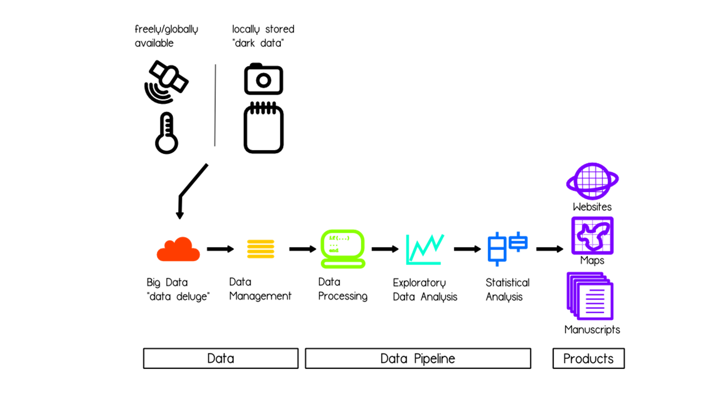

```{r setup, echo=FALSE, results="hide", message=FALSE, warning=FALSE}
knitr::opts_knit$set(root.dir = '../')
knitr::opts_chunk$set(cache = TRUE, 
                      fig.align = "center", 
                      fig.height = 4.5, 
                      fig.width = 7.5,
                      dev = "svg")

library(readr)
library(tidyr)
library(dplyr)
library(ggplot2)

file.exists("../data/trawl_abiotic.csv")
file.exists("../data/trawl_biomass.csv")

# load the data
abiotic <- read_csv("../data/trawl_abiotic.csv", guess_max = 5000)
head(abiotic)

# modify the data
abiotic_abrev <- filter(abiotic, year < 2005)
```

## RStudio Tips
- Outline button
- Clear console (Ctrl-l)
- Drag and drop code 
- Tools -> Global Options -> Code -> Diagnostics -> "Provide R Style Diagnostics"


## Before we get started
- Could you click on File -> New -> RMarkdown?
- Do you have the abiotic data set?
- Have you installed packages knitr, kfigr, xtable, and the usual tidyverse

## Overview
- Reproducible Research (RR): reasons and benefits
- Dynamic Documents with RMarkdown
    - introduction 
    - basics
    - workflows: What i've learned....so far
    - intermediate
    - advanced

## Reproducible Research (RR)
- Reproducibility is a cornerstone of science

## A graphical model for RR (Lewis et al. accepted) {.smaller}
<style> 
  #slideID > p { 
    margin-top: -100px; 
  } 
</style>


## Reproducible Research (RR)
- Reproducibility is a cornerstone of science
- Reproducibility is increasingly difficult because of:
    - Big data: data decisions
    - complex statistics
    - multiple authors/ increased collaboration
- Without the code and data, an analysis is not reproducible
- But a document without the code and data is difficult to reproduce

## RR with Dynamic Documents (DD)
* What is a dynamic document?
    - source document with program code and text    
        - minimizes cutting/pasting - tedious and error prone
        - links writing and analysis
- DD can be made with Markdown or LaTeX (LyX)
    - word processing (WYSIWYG) v document preparation (WYSISYM)
    - seperates writing from formatting
    - formatting is consistent, professional, and automatic
- package knitr (Yihui Xie) - links R with document

## Benefits of RR with DD {.smaller}
- Idealistic: 
    - makes for better, more productive science 
    - can address bigger scale questions
    - analogy (bad science as a disease):
        - prevention ~ education
        - medication (traditional) ~  peer-review + editor
        - medication (modern) ~  peer-review + editor + RR
- Practical:
    - streamline workflow
    - rapidly update your own work
    - organize and retrieve analyses (DD + RProject)
    - rescue projects
    - improved collaboration and review of projects
    - steal code 
    
## Objectives
- Basic: produce a dynamic document (html, pdf, or Word) in Rmarkdown
- Think about your own workflows
- Intermediate: make it pretty
- Advanced: make it functional, i.e., fully reproducible

- and never use Word or PowerPoint again.....ever!

## RMarkdown: the basics
<style> 
  #slideID > p { 
    margin-top: -100px; 
  } 
</style>


## RMarkdown: the basics of "chunks"
- The "r chunk"
- Start a r chunk: type ```{r}
- Type some R code
- End a r chunk: type ```
- The "text chunk" goes in between the r chunks
    - e.g. "In a hole in the ground there lived a hobbit....."

## Basic Exercise
Now it's your turn:    

- begin an R markdown file
- read in the abiotic data file
- filter out the years after 2005
- edit it to produce the following example....
- save the file and knit it

## Let's talk about workflows!
<style> 
  #slideID > p { 
    margin-top: -50px; 
  } 
</style>


## Workflow evolution 1
<style> 
  #slideID > p { 
    margin-top: -50px; 
  } 
</style>


## Workflow evolution 2
<style> 
  #slideID > p { 
    margin-top: -50px; 
  } 
</style>


## Workflow evolution 3
<style> 
  #slideID > p { 
    margin-top: -50px; 
  } 
</style>


## Intermediate RMarkdown - prettify the document
- Change the YAML header
- Add headers to the text
- Add a figure caption
- Control what to display

## Intermediate RMarkdown : hashtags - they're not just for Twitter
<style> 
  #slideID > p { 
    margin-top: -100px; 
  } 
</style>


## Intermediate RMarkdown:  modify the "chunks"
- ```{r} starts the chunk
- ``` ends the chunk
- But you can add loads of stuff to {r}
  - Add a caption - {r fig.cap = "the title"}
  - Control what to display
    - code {r echo = F}
    - warnings {r warnings = F}
    - messages {r messages = F}
    - results {r results = "hide"}
    - evaluate chunk but code and output not displayed {r include=FALSE}

## RMarkdown intermediate exercises
Copy the first exercise to a new file (save it) and produce the following document

## Advanced RMarkdown
- Label a figure in the text, i.e., cross reference
- Calculate a parameter and insert into text
- Make a table 
- Update the document

## Advanced RMarkdown: cross reference a figure
- Label figure using hard code, e.g., "blah, blah, blah (Fig. 1)"
- or.....
- Add a chunk label: {r "chunk label", fig.cap = "the title"}
    - e.g., {r histo1, fig.cap = "title"}
- Embed R code in text chunk: ``` ``r "r some function(arguments)"`` ```
- Label figure dynamically, e.g., "blah, blah, blah " blah, blah, blah,` ``r paste0("r ", "figr(label =", "'", "histo1", "'", ", TRUE, type = ", '"Fig."', ")")`` `"


## Advanced RMarkdown: calculate a parameter and insert into text
- hard code parameters, e.g., "blah, blah, blah mean = 10, SD = 2"
- or....
- embed R code in text chunk ``` ``r "r some function(arguments)"`` ```
- dynamically code parameters, e.g. "blah, blah, blah, mean= ` ``r paste0("r ", "mean(abiotic_abrev$depth)")`` `
    - result, e.g. "blah, blah, blah, mean= `r mean(abiotic_abrev$depth)` "
- dynamic and pretty, e.g., "blah, blah, blah, mean = ` ``r paste0("r ", "round(mean(abiotic_abrev$depth), 2)")`` ` "
    - result, e.g., "blah, blah, blah, mean = `r round(mean(abiotic_abrev$depth), 2)` "

## Advanced RMarkdown: make the table
- Various package options (kable, xtable, stargazer)
- the steps (for xtable):
    - create a summary first
    - wrap it the summary in xtable and make an object
        - e.g., tab <- xtable(the summary)
    - print the table
        - print(tab, comment = F)

## Advanced exercises
- Copy the second exercise to a new file (save it) and produce the following document
- Hint: the summary is the mean and SD of depth by NAFO division - use the tidyverse


- .....then update it  to 2010 :)
  
## Next steps in RMarkdown {.smaller}
 - YAML headers
 - hooks
 - inserting graphics
 - Presentations (ioslides and RPres)
 - Posters (dashboard)
 - Adding bibliographies
 - templates
 - insert equations
 - Notebooks
 - packrat (so package updates don't mess things up)
 - Plotly
 - Ctrl-Shift-k
 - package editR

## Help {.smaller}
Books  
Xie, Y. 2013. Dynamic Documents with R and knitr. CRC Press, London.
Gandrud, C. 2014. Reproducible Research with R and RStudio. 2nd Edition. CRC Press, Boca Raton, FL. 

Cheatsheets  
http://ropensci.github.io/reproducibility-guide/sections/introduction/
https://www.rstudio.com/wp-content/uploads/2015/03/rmarkdown-reference.pdf

Reproducible Research webpages  
http://ropensci.github.io/reproducibility-guide/sections/introduction/

Knitr or Markdown webpages  
https://yihui.name/knitr/
https://support.rstudio.com/hc/en-us/articles/205368677-R-Markdown-Dynamic-Documents-for-R
https://sachsmc.github.io/knit-git-markr-guide/knitr/knit.html
http://kbroman.org/knitr_knutshell/pages/Rmarkdown.html

YAML  
http://rmarkdown.rstudio.com/html_document_format.html
http://rmarkdown.rstudio.com/pdf_document_format.html
http://rmarkdown.rstudio.com/word_document_format.html


