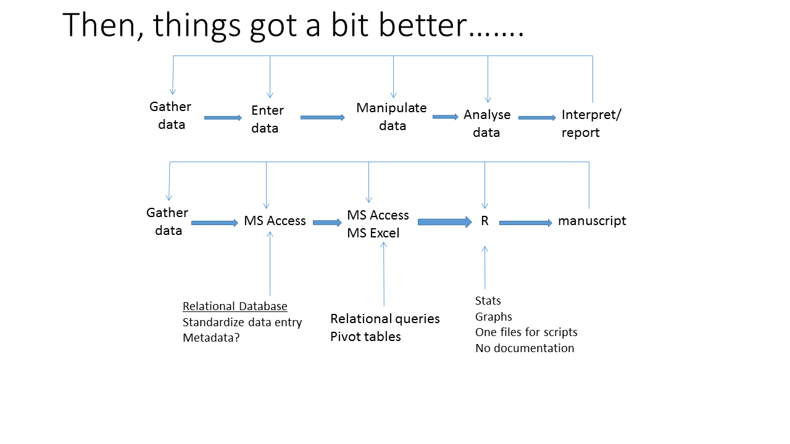

```{r setup, echo=FALSE, results="hide", message=FALSE, warning=FALSE}
knitr::opts_knit$set(root.dir = '../')
knitr::opts_chunk$set(cache = TRUE, 
                      fig.align = "center", 
                      fig.height = 4.5, 
                      fig.width = 7.5,
                      dev = "svg")
```

## Overview
- Workflows: What i've learned....so far
- Reproducible Research (RR): reasons and benefits
- Dynamic Documents with RMarkdown
    - basics
    - intermediate
    - advanced

## Workflow
<style> 
  #slideID > p { 
    margin-top: -50px; 
  } 
</style>


## Workflow evolution 1
<style> 
  #slideID > p { 
    margin-top: -50px; 
  } 
</style>


## Workflow evolution 2
<style> 
  #slideID > p { 
    margin-top: -50px; 
  } 
</style>


## Workflow evolution 3
<style> 
  #slideID > p { 
    margin-top: -50px; 
  } 
</style>


## Reproducible Research (RR)
- Reproducibility is a corner stone of science
- Reproducibility is increasingly difficult
    - complex statistics
    - increased collaboration
    - Big data
    - computer scripts are increasingly central


## Benefits of RR
- Idealistic
    - Better science
        - prevention ~ education
        - medication (traditional) ~  peer-review + editor
        - medication (modern) ~  peer-review + editor + RR
- Practical
    - recover your own work
    - streamline workflow
        - organize and retrieve analyses
    - rescue projects
    - improved collaboration and review of projects

## Dynamic Documents
- Word processing v document preparation
- WYSIWYG v WYSISYM
- Examples:
  - Markdown
  - LaTeX (LyX)

## RMarkdown: the basics


## RMarkdown: the basics
  - YAML header
  - Text chunk
  - R chunk
  - package knitr

## Basic Exercises
- Using the abiotic and/or biomass data:
  - create a markdown document with a text chunk and an r chunk.  
  - For the r chunk, use the tidyverse tools we've learned to read in the data, filter the data, and make a graph. 
  - Text chunk can be minimal: just get the idea.
  - Knit the document as pdf, html, or word.

## Intermediate RMarkdown
- insert a figure
- make a table
- calculate a parameter and insert into text

## Intermediate exercises
- Copy the first exercise to a new file and:
  - insert graphic
  - make a table
  - insert parameter from a linear model
  
## Advanced RMarkdown - the boring but useful stuff
 - YAML header
 - hooks
 
## Advanced exercises
Copy the second exercise to a new file and:
  - modify the YAML header
  - modify the hooks
  
## Summary: Rmarkdown generic recipe
- YAML
- hooks
- text chunk
- r chunk
  - tables
  - graphs
  - parameters

## A graphical model for RR and open science using dynamic documents (Lewis et al. accepted) {.smaller}
<style> 
  #slideID > p { 
    margin-top: -100px; 
  } 
</style>


## Summary: other options
- Compile Notebook
- Slide shows in markdown (Beamer, ioslides)
- TeX/LaTeX
    - LyX
    - BibTeX
- Presentations
  - Beamer
  - ioslides
  - RPres

## Summary: other options (graphical summary)

  
## Help {.smaller}
Books
Xie, Y. 2013. Dynamic Documents with R and knitr. CRC Press, London.
Gandrud, C. 2014. Reproducible Research with R and RStudio. 2nd Edition. CRC Press, Boca Raton, FL. 

Cheatsheets
http://ropensci.github.io/reproducibility-guide/sections/introduction/
https://www.rstudio.com/wp-content/uploads/2015/03/rmarkdown-reference.pdf

Reproducible Research webpages
http://ropensci.github.io/reproducibility-guide/sections/introduction/

Knitr webpages
https://yihui.name/knitr/

## Sample document
- Zuur's Exploratory data analysis - put on Github
