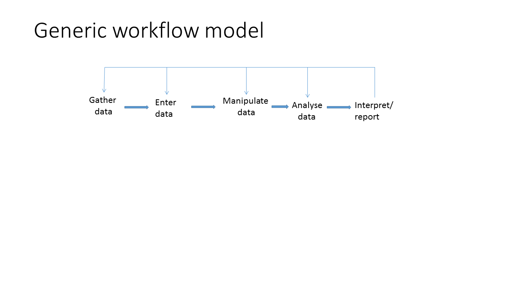
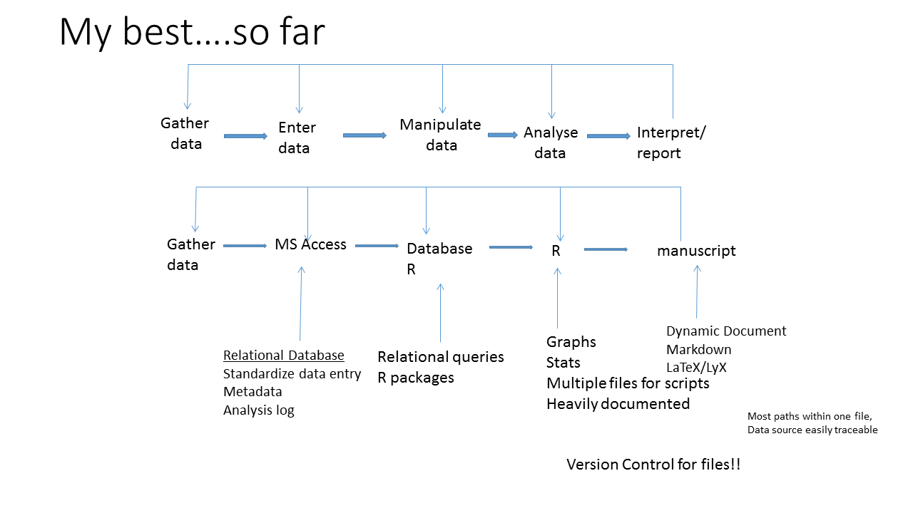

```{r setup, echo=FALSE, results="hide", message=FALSE, warning=FALSE}
knitr::opts_knit$set(root.dir = '../')
knitr::opts_chunk$set(cache = TRUE, 
                      fig.align = "center", 
                      fig.height = 4.5, 
                      fig.width = 7.5,
                      dev = "svg")
```

## Overview
- Workflows: What i've learned....so far
- Reproducible Research (RR): reasons and benefits
- Dynamic Documents with RMarkdown
    - basics
    - intermediate
    - advanced

## Workflow
<style> 
  #slideID > p { 
    margin-top: -50px; 
  } 
</style>


## Workflow evolution 1
<style> 
  #slideID > p { 
    margin-top: -50px; 
  } 
</style>


## Workflow evolution 2
<style> 
  #slideID > p { 
    margin-top: -50px; 
  } 
</style>


## Workflow evolution 3
<style> 
  #slideID > p { 
    margin-top: -50px; 
  } 
</style>


## Reproducible Research (RR)
- Reproducibility is a cornerstone of science
- Reproducibility is increasingly difficult because of:
    - complex statistics
    - multiple authors increased collaboration
    - Big data: data decisions
- However, without the code and data, a manuscript is not reproducible

## Benefits of RR
- Idealistic: RR makes for better science (or helps prevents bad science)
  - prevention ~ education
  - medication (traditional) ~  peer-review + editor
  - medication (modern) ~  peer-review + editor + RR
  - see paper
- Practical:
    - streamline workflow
    - rapidly update your own work
    - organize and retrieve analyses
    - rescue projects
    - improved collaboration and review of projects

## Dynamic Documents
- Word processing (WYSIWYG) v document preparation (WYSISYM)
- Seperates writing from formatting
- Examples:
  - Markdown
  - LaTeX (LyX)
- knitr (Yihui Xie)

## Objectives
- produce an document (html, pdf, or Word) in Rmarkdown
- make it pretty
- make it dynamic

## RMarkdown: the basics


## Basic Exercises
- Use the abbreviated abiotic and/or biomass data
- Create a markdown document with a text chunk and an r chunk  
  - For the r chunk, read in the data, filter the data, and make a graph 
  - Text chunk can be minimal: just get the idea
  - Knit the document as pdf, html, or MS Word

## Intermediate RMarkdown - prettify the document
- Change the YAML header
- Add headers
- Add a label and a caption
- Control what to display

## Intermediate exercises
Copy the first exercise to a new file:
- Change the YAML header (title and date)
- Add headers (e.g. Introduction, Results)
- Add a label and a caption - put label in text
- Control what to display (change the echo = and results= options)

## Advanced RMarkdown
- insert a figure
- make a table (kable)
- calculate a parameter and insert into text

## Advanced exercises
- Copy the second exercise to a new file:
  - insert a graphic
  - make a table (create an r chunk and make the table)
  - perform a simle linear model and insert R-squared in text
  - update the above using the full data set
  
## Next steps RMarkdown
 - YAML headers
 - hooks
 - inserting graphics
 - Presentations (ioslides and RPres)
 - Posters (dashboard)
 - Adding bibliographies
 - templates
 - insert equations

## Summary: other options
- Compile Notebook
- TeX/LaTeX
    - LyX
    - BibTeX
  - Beamer

## A graphical model for RR and open science using dynamic documents (Lewis et al. accepted) {.smaller}
<style> 
  #slideID > p { 
    margin-top: -100px; 
  } 
</style>


## Help {.smaller}
Books
Xie, Y. 2013. Dynamic Documents with R and knitr. CRC Press, London.
Gandrud, C. 2014. Reproducible Research with R and RStudio. 2nd Edition. CRC Press, Boca Raton, FL. 

Cheatsheets
http://ropensci.github.io/reproducibility-guide/sections/introduction/
https://www.rstudio.com/wp-content/uploads/2015/03/rmarkdown-reference.pdf

Reproducible Research webpages
http://ropensci.github.io/reproducibility-guide/sections/introduction/

Knitr webpages
https://yihui.name/knitr/
https://support.rstudio.com/hc/en-us/articles/205368677-R-Markdown-Dynamic-Documents-for-R
https://sachsmc.github.io/knit-git-markr-guide/knitr/knit.html

YAML
http://rmarkdown.rstudio.com/html_document_format.html
http://rmarkdown.rstudio.com/pdf_document_format.html
http://rmarkdown.rstudio.com/word_document_format.html

## Sample document
- Zuur's Exploratory data analysis - put on Github
