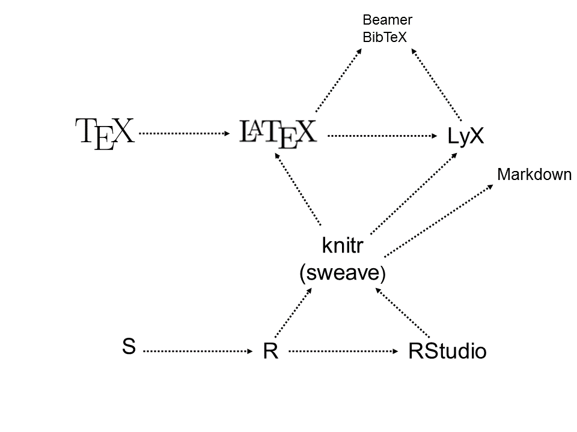

## Overview
- Reproducible Research (RR)
  - Reasons for RR
  - Big Data - Open Science
  - Workflow Evolution
  - The Tools
- Markdown
    - basics
    - generic recipe
    - intermediate
    - advanced
- Next Steps

## Reproducible Research (RR)
- Reproducibility is a corner stone of science
- Reproducibility is increasingly difficult
    - complex statistics
    - increased collaboration
    - Big data
    - computer scripts are increasingly central
- Traditional final product = paper
- RR final product = paper + code  + data

## Benefits of RR
- Idealistic Benefits
    - Better science
        - prevention ~ education
        - medication ~  peer-review + editor + RR
- Practical Benefits
    - dynamic documents
    - streamline workflow
    - one file
        - organize and retrieve analyses
        - rescue projects
        - collaborate and review projects

## Idealistic Benefits - Open Science

## Practical benefits - Workflow evolution

## Practical benefits - Workflow evolution 1

## Practical benefits - Workflow evolution 2

## Practical benefits - Workflow evolution 3

## RR - The tools

## Markdown - Basics
- Text chunk
- R chunk

## Markdown generic recipe
- YAML
- hooks
- text chunk
- r chunk
- tables
- graphs

## Intermediate markdown
- Zuur's Exploratory data analysis

## Advanced markdown
- R files (data, functions, analysis, text)

## The tools

## Next steps
- Compile Notebook
- Slide shows in markdown (Beamer, iosslides)
- TeX/LaTeX
    - LyX
    - BibTeX
- Github

