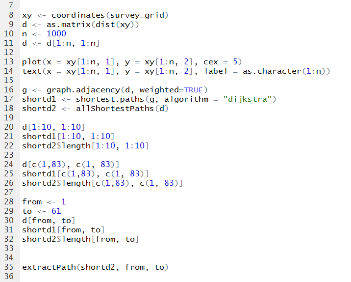

```{r setup, echo=FALSE, results="hide", message=FALSE, warning=FALSE}
knitr::opts_knit$set(root.dir = '../')
knitr::opts_chunk$set(cache = TRUE, 
                      fig.align = "center", 
                      fig.height = 4.5, 
                      fig.width = 7.5,
                      dev = "svg")
```

# So......how do you organize your projects, folders, and files?

# Examples of what not to do!!!

## Uncommented code



## Long chunks of code


## Inconsistent style


## All files in one folder


## No metadata and/or project description


## Repeating yourself (copy/paste, copy/paste, ...)


## Copy/paste results into MS WORD


## Lots of versions of a file

  

## Best practices

- Uncommented code; *Write for yourself 6 mo. from now*
- Long chunks of code; *Split code into tasks*
- Inconsistent style; *Suscribe to a style guide*
- All files in one folder; *Nest similar file types in folders*
- No metadata and/or project description; *Make a DESCRIPTION and README file*
- Repeating yourself; *Use functions*
- Copy/paste results into MS WORD; *Use Rmarkdown*
- Lots of versions of a file; *Use a version control system (e.g. git)*

## Workshop outline of next 4 weeks

> - **Today:** Project management: how to effectively organize a project in R
> - **November 9th:** The very basics of programming in R: functions, debugging, warnings and errors, tests, data types
> - **November 23rd:** Rmarkdown and reproducible research
> - **December 7:** Keeping track of your work using version control with git (not just for R users!)

## Objectives {.build}

- Introduce the concept of a Research Compendium
- Demonstrate the set-up and workflow of a compendium
- Give a brief teaser of custom functions, Rmarkdown and git

## Research Compendium

- What is it?
    - A compendium is a convention for how to organize key files for a project (data, code, text, etc.) into directories
- Why use one?
    - Simplifies file management
    - Streamlines analytical workflows
    - More efficient for you, future you and your collaborators
    - Reproducible and extensible
- How should files be organized?
    - Apply the conventions used for building an R package
    
## Getting started {.smaller}

Use the `devtools` package to set-up the structure

```{r, eval=FALSE}

## Project path and name
root_dir <- "examples"                                  # path to your project
proj_name <- "skeleton"                                 # project name

## Metadata for the project (NOT the data!!!!!)
proj_metadata <- list("Title" = "Project title",
                      "Authors@R" = 'person("First", "Last", 
                                            email = "first.last@example.com", 
                                            role = c("aut", "cre"))',
                      "Description" = "This is a research compendium for...",
                      "License" = "NA")

## Generate the skeleton for the project
devtools::create(file.path(root_dir, proj_name),
                 description = proj_metadata)           # generates a minimum R package skeleton
devtools::use_git(pkg = file.path(root_dir, proj_name)) # Initalize local git repository
dir.create(file.path(root_dir, proj_name, "data"))      # adds a data folder to the directory
dir.create(file.path(root_dir, proj_name, "analysis"))  # adds an analysis folder to the directory

```


## Core structure {.smaller}

Code on the last slide generates a structure similar to the one recommended here: https://github.com/ropensci/rrrpkg

```
skeleton
|
|- skeleton.Rproj       # RStudio Rproj file; one file to rule them all
|
|- DESCRIPTION          # project metadata and dependencies 
|
|- data/                # raw data, not changed once created
|  +- my_data.csv       # data files in open formats such as TXT, CSV, TSV, etc.
|
|- R/                   # reusable code
|  +- my_functions.R    # custom R functions that are used more than once in the project
|
|- analysis/            # any programmatic code 
|  +- my_scripts.R      # R code or R markdown files used to analyse and visualise data 

```

# Basic example

## Setup - step 1 {.smaller}

Setup the compendium

```{r, eval=FALSE}

## Project path and name
root_dir <- "examples"                                  # path to your project
proj_name <- "basic"                                    # project name

## Metadata for the project
proj_metadata <- list("Title" = "Trends in mean catch of redfish in the trawl survey",
                      "Authors@R" = 'c(person("Paul", "Regular", email = "Paul.Regular@dfo-mpo.gc.ca", 
                                              role = c("aut", "cre")),
                                       person("Keith", "Lewis", email = "Keith.Lewis@dfo-mpo.gc.ca", 
                                              role = "aut"))',
                      "Description" = "This is a research compendium for the analysis of trends in 
                                       mean catch of redfish in the trawl survey.",
                      "License" = "NA",
                      "Imports" = c("readr", "dplyr", "ggplot2"))

## Generate the skeleton for the project
devtools::create(file.path(root_dir, proj_name),
                 description = proj_metadata)           # generates a minimum R package skeleton
devtools::use_git(pkg = file.path(root_dir, proj_name)) # Initalize local git repository
dir.create(file.path(root_dir, proj_name, "data"))      # adds a data folder to the directory
dir.create(file.path(root_dir, proj_name, "analysis"))  # adds an analysis folder to the directory

```

## Setup - step 2

Add the data

```
|- data/
|-  +- trawl_abiotic.csv
|-  +- trawl_biomass.csv

```
- These data should remain static


## Setup - step 3

Open `strat.Rproj` in RStudio

- Working directory will automatically = project directory

## Setup - step 4

Save an R script in the analysis folder and start writing code
```
|- analysis/
|-   +- trend_analysis.R
```
- Work from the project directory (e.g. `read.csv("data/trawl_biomass.csv")`)
- If your script grows too long, it may be useful to split and number scripts
    ```
    |- analysis/
    |-   +- 001_manipulate.R
    |-   +- 002_visualize.R
    |-   +- 003_model.R
    ```

## Sample script {.smaller}

A simple `trend_analysis.R` script in the `analysis/` folder may look like this:

````r
`r paste(readLines("examples/basic/analysis/trend_analysis.R"), collapse = "\n")`
````
**WARNING:** this is not a proper analysis of these data! For demonstration only

## Sample script {.smaller}

...which produces this plot:

```{r warning=FALSE, echo=FALSE, message=FALSE, results="hide", fig.height = 4, out.width="80%", fig.align='left'}

print(source("examples/basic/analysis/trend_analysis.R"))

```

## Exercises

- Set-up a research compendium for an analysis of habitat (depth and/or temperature) associations for shrimp, cod, halibut and/or redfish
    - Modify the metadata
    - Add the the biomass and abiotic csv files to the data folder
    - Write a script to:
        - Merge biomass and abiotic datasets
        - Make and export some figures
        
## But what if...

- you want to run the analysis on multiple species?
- you need to produce a document?
- you struggle to keep track of your changes?
- etc.

# Intermediate example

```{r, eval=FALSE, include=FALSE}

## Project path and name
root_dir <- "examples"                                  # path to your project
proj_name <- "intermediate"                             # project name

## Metadata for the project
proj_metadata <- list("Title" = "Trends in mean catch of shrimp, cod, halibut and redfish in the trawl survey",
                      "Authors@R" = 'c(person("Paul", "Regular", email = "Paul.Regular@dfo-mpo.gc.ca", role = c("aut", "cre")), person("Keith", "Lewis", email = "Keith.Lewis@dfo-mpo.gc.ca", role = "aut"))',
                      "Description" = "This is a research compendium for the analysis of trends in mean catch of shrimp, cod, halibut and redfish in the trawl survey.",
                      "License" = "NA",
                      "Imports" = c("readr", "dplyr", "ggplot2"))

## Generate the skeleton for the project
devtools::create(file.path(root_dir, proj_name),
                 description = proj_metadata)           # generates a minimum R package skeleton
devtools::use_git(pkg = file.path(root_dir, proj_name)) # Initalize local git repository
dir.create(file.path(root_dir, proj_name, "data"))      # adds a data folder to the directory
dir.create(file.path(root_dir, proj_name, "analysis"))  # adds an analysis folder to the directory


```


## Functions {.smaller}

While it is tempting to copy and paste this script and replace `redfish` with `shrimp`, etc.

````r
`r paste(readLines("examples/basic/analysis/trend_analysis.R"), collapse = "\n")`
````

## Functions {.smaller}

...it's not too hard to wrap simple scripts into a function and document the function using `roxygen`:

````r
`r paste(readLines("examples/intermediate/R/trend_fun.R"), collapse = "\n")`
````

## Functions {.smaller}

Here we make a function, called `trends`, for calculating mean, sd, etc. by year

````r
`r paste(readLines("examples/intermediate/R/trend_fun.R")[1:25], collapse = "\n")`
````

## Functions {.smaller}

And another, called `plot_trends`, for plotting the results

````r
`r paste(readLines("examples/intermediate/R/trend_fun.R")[27:46], collapse = "\n")`
````

## Functions {.smaller .build}

- Place reusable functions in the `R/` folder
- They will simplify the scripts in your `analysis/` folder
- For example, placing the above-mentioned functions in `R/trend_fun.R` simplifies `analysis/trend_analysis.R` to:

```r
    ## Load packages
    library(tidyverse)

    ## Import trawl data
    biomass <- read_csv("data/trawl_biomass.csv")

    ## Visualize trends
    plot_trends(biomass, species = "redfish")
```
- We will spend more time on functions during our **November 9th** workshop titled *The very basics of programming in R: functions, debugging, warnings and errors, tests, data types*

## Rmarkdown

- An alternate to copying output from R into Word, Excel, PowerPoint, etc. is to use Rmarkdown
- Rmarkdown integrates code and text and can produce documents of many different formats
- For our intermediate example, we output a presentation using an `Rmd` file:
    ```
    |- analysis/
    |-   +- trend_analysis.Rmd
    ```

## Rmarkdown


## Rmarkdown {.smaller}

...which renders to slides that look like this:


- We will cover more during our **November 23rd** workshop titled *Rmarkdown and reproducible research*

## git {.smaller}

- Avoid the multiple v1...v12...final...final2 file issues by using a version control system
- Most basic workflow: make changes to code or doc and "commit" your changes with notes
- Creates a running record of what you have done, like a lab notebook
- For example:
    - 


## git

- Only scratching the surface here
- For more details, join our **December 7** workshop titled *Keeping track of your work using version control with git (not just for R users!)*

## Exercises

- For the adventurous: convert one of your projects to a compendium


## References / further readings

> - This presentation was heavily based on this really useful doc: https://github.com/ropensci/rrrpkg
> - Keep an eye on in development packages to simplify reproducable research in R: https://github.com/benmarwick/rrtools
> - For more details on building R packages, see: [Wickham, Hadley, R Packages: Organise, test, document, and share your code. O'Reilly.](http://r-pkgs.had.co.nz/)
> - Hadley Wickham's R style guide: http://adv-r.had.co.nz/Style.html
> - Hadley Wickham's introduction to roxygen: https://cran.r-project.org/web/packages/roxygen2/vignettes/roxygen2.html
> - For similar and more detailed suggestions, checkout this paper titled "Good enough practices in scientific computing": http://journals.plos.org/ploscompbiol/article?id=10.1371/journal.pcbi.1005510
