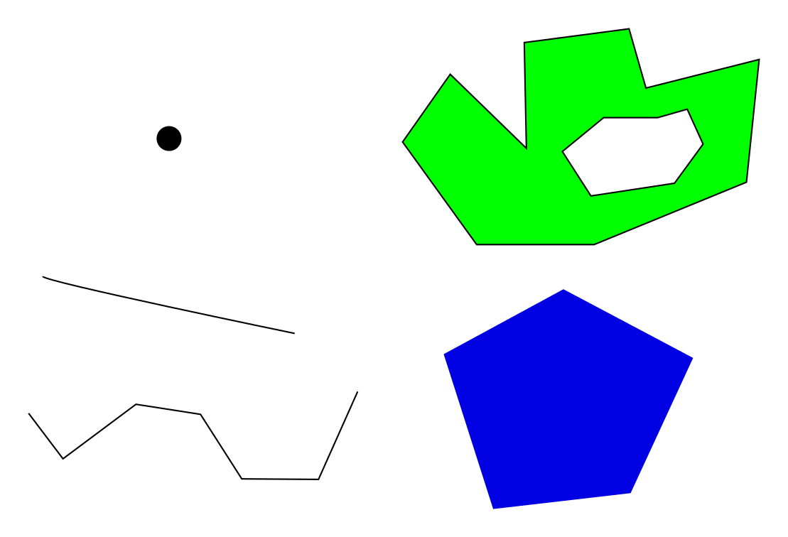

```{r setup, include=FALSE}
options(htmltools.dir.version = FALSE)
```

# What we'll be talking about today:
.huge[
- Why map in R? 
]

--

.huge[
- Short intro to spatial data and GIS concepts
]
--

.huge[
- What are the sp and sf packages, and why does it help to know both?
]

--

.huge[
- How to, for sp and sf: 
]
  - Load maps
  - Putting data with spatial coordinates into R spatial data format
  - Plotting basic maps

--

.huge[
- A quick demo of a couple useful tools: 
]
  - Plotting sf and sp maps in ggplot2
  - Rgooglemaps
  
---
# Why map in R?

.huge[
- Makes it easier to get information from maps
]

--

.huge[
- Can map data and model outputs more easily
]

--

.huge[
- It's reproducible]

--

.huge[
- You can make really nice maps]


---


---

#The very basics for GIS
.large[
Why do we need special packages for spatial data? It's all lat-long anyway, right? 
]
--

.pull-left[

.huge[ 
1.Spatial objects are complex
]


]

--

.pull-right[

.huge[ 
2.We live on a mishapen globe
]


]

---

#Getting set up
.huge[
```{r, eval=FALSE}
library(sp)
library(rgdal)
library(sf)
library(raster)

atlantic_map_sp = readOGR("data/map_layers/atlantic_map.shp")
atlantic_map_sf <- st_as_sf(atlantic_map_sp)
plot(atlantic_map_sp)
```
]
---
class: left, middle
#Getting set up

.center[
```{r, eval=TRUE, echo=FALSE, cache=TRUE,message=FALSE}
library(sp)
library(rgdal)
library(sf)
library(raster)

atlantic_map_sp = readOGR("data/map_layers/atlantic_map.shp",verbose = F)
atlantic_map_sf <- st_as_sf(atlantic_map_sp)
plot(atlantic_map_sp)
```
]
---

class: center, middle

# Next: working with spatial data in sp

Slides created via the R package [**xaringan**](https://github.com/yihui/xaringan).


